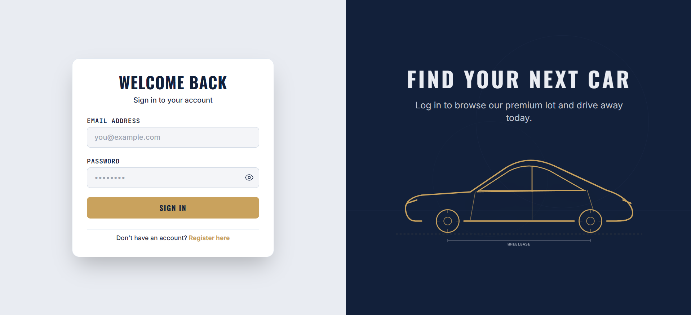
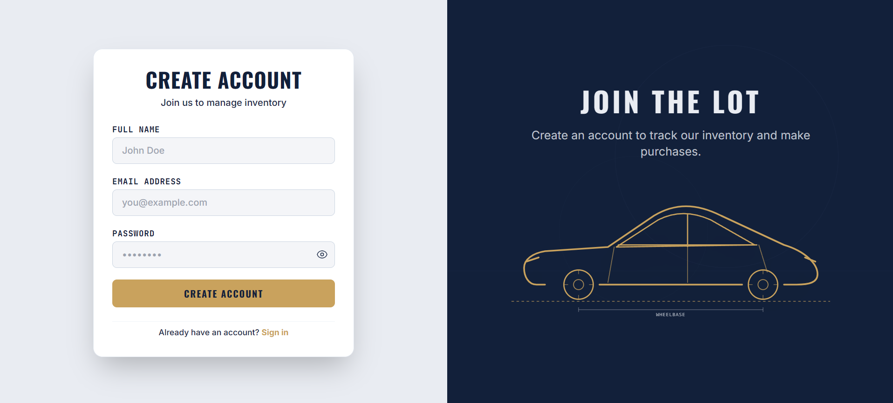
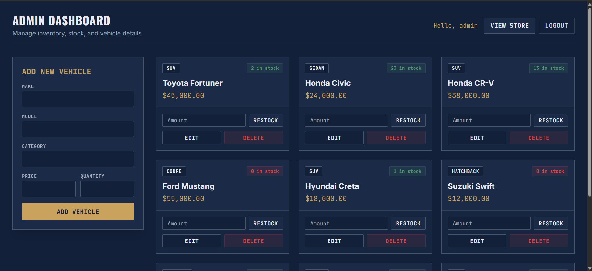
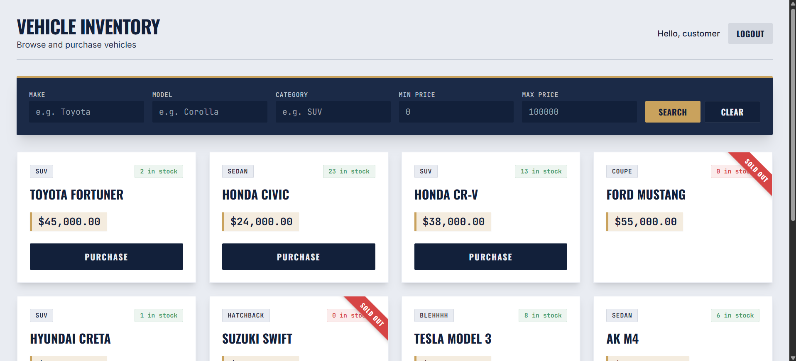
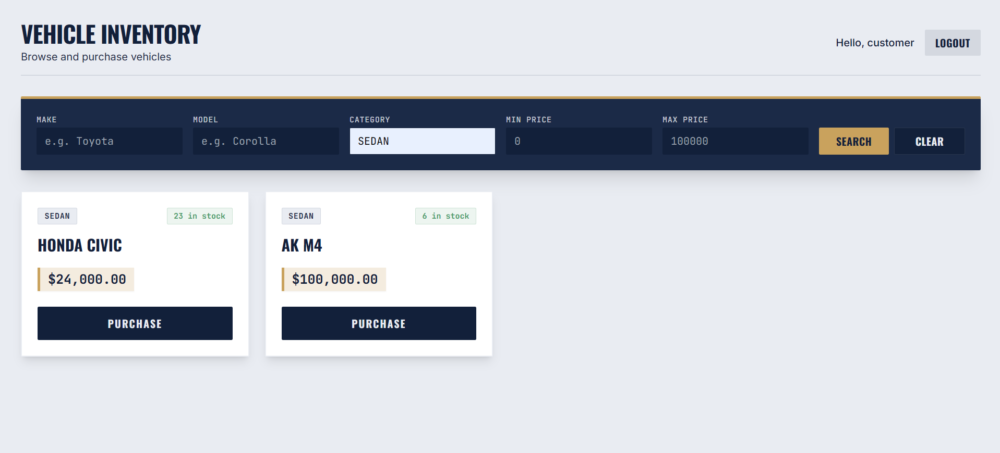

# Car Dealership Inventory System

## Project Overview
The Car Dealership Inventory System is a full-stack web application designed to manage a car dealership's inventory. It features a robust role-based authentication system, separating standard customers from dealership administrators. 

Customers can browse the showroom, view detailed specifications of available vehicles, and securely "purchase" them. Administrators have access to a dedicated dashboard where they can efficiently manage the entire lot—adding new vehicle models, updating specifications, restocking inventory, and removing discontinued models. The frontend is styled using a custom "showroom blueprint" design system, creating an immersive, premium dealership experience.

## Live Application
🔗 **[View the Live Application Here](https://car-dealership-psi-one.vercel.app/)**

## Tech Stack
- **Frontend**: React, Vite, TailwindCSS v3 (Custom Showroom Theme), Axios, React Router.
- **Backend**: Node.js, Express.js (v5), MongoDB, Mongoose, JWT (JSON Web Tokens).
- **Security**: Helmet, Express-Rate-Limit, Morgan (Logging), CORS.
- **Testing**: Jest, Supertest, MongoDB Memory Server.

---

## Local Setup & Installation

### Prerequisites
- [Node.js](https://nodejs.org/) (v16 or higher)
- [MongoDB](https://www.mongodb.com/) (Local instance or MongoDB Atlas cluster)
- Git

### 1. Clone the Repository
```bash
git clone <YOUR_GIT_REPOSITORY_URL>
cd incubyte-car-dealership
```

### 2. Backend Setup
```bash
cd backend

# Install dependencies
npm install

# Create environment variables file
touch .env
```
Add the following to your `.env` file:
```env
PORT=5000
MONGO_URI=mongodb://localhost:27017/car-dealership
JWT_SECRET=your_super_secret_jwt_key
JWT_EXPIRES_IN=7d
CLIENT_URL=http://localhost:5173
```
Start the backend server:
```bash
npm run dev
```

### 3. Frontend Setup
Open a new terminal window:
```bash
cd frontend

# Install dependencies
npm install

# Create environment variables file
touch .env
```
Add the following to your `.env` file:
```env
VITE_API_BASE_URL=http://localhost:5000/api
```
Start the frontend development server:
```bash
npm run dev
```
The application will be running at `http://localhost:5173`.

---

## Screenshots







---

## Test Report
The backend is fully tested using Jest and Supertest, executing against an in-memory MongoDB server (`mongodb-memory-server`) to ensure isolated and reliable testing environments without affecting production databases.

**Test Suite Coverage:**
- Authentication (Register/Login validation, JWT verification, role-based protection).
- Vehicle Management (CRUD operations, validation, authorization logic).
- Inventory Management (Purchasing logic, out-of-stock validation).
- Health & System Checks.

See test-report.txt for detailed coverage and test results.

---

## My AI Usage

### 1. Architectural Planning & Scaffolding
I used **Gemini 3.6 Flash (Antigravity)** to rapidly scaffold the initial project structure, including setting up the Vite React frontend, the Node/Express backend, and configuring TailwindCSS.

### 2. Full-Stack Feature Implementation
I iteratively prompted the AI to build out core functionalities:
- **Authentication**: Implementing JWT-based auth, secure password hashing (bcrypt), and context-based state management on the frontend with `localStorage` persistence.
- **Role-Based Access Control**: Creating middleware to distinguish between 'admin' and 'user' roles, and protecting API endpoints and React routes accordingly.
- **RESTful API Design**: Structuring the Express controllers, Mongoose models, and services for a clean separation of concerns.

### 3. Design System & UI
I instructed the AI to build a custom "Dealership Showroom" design system utilizing specific color palettes (`showroom-navy`, `dealer-brass`, `chalk`) and font families (Oswald, JetBrains Mono). The AI also generated responsive UI layouts and an inline SVG blueprint illustration for the split-screen auth pages.

### 4. Debugging & Deployment Prep
I utilized the AI to debug Vercel deployment routing issues (implementing `vercel.json` for SPA rewrites), resolve Express v5 compatibility errors, and configure production-ready security middlewares (Helmet, Rate Limiting).

*(A full log of my prompts can be found in the `PROMPTS.md` file in the root directory).*
